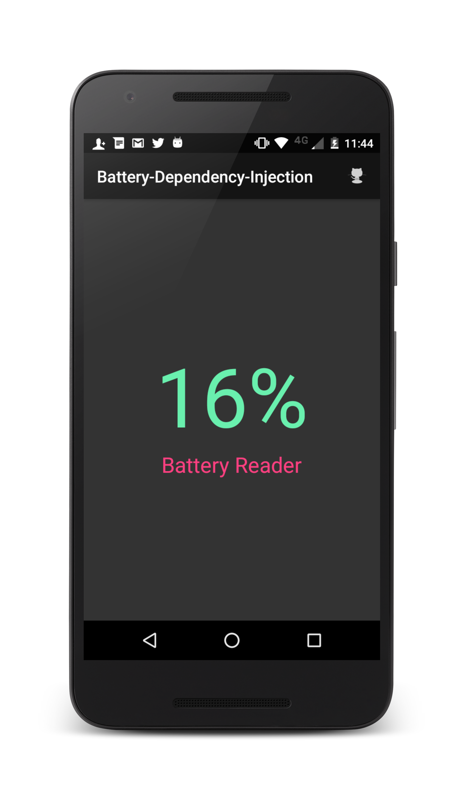

# Dependency-Injection-Android / Battery Reader

Example android Dependency Injection used to explain how to use this pattern in our android applications simulating a dependency Injector and support an article explanation [Una aplicación android utilizando Inyección de dependencias](https://erikjhordan-rey.github.io/blog/2016/04/25/ANDROID-dependency-injection.html).

# Demo

# Inspiring
Thank you [Chiu-Ki Chan](https://developers.google.com/experts/people/chiu-ki-chan) Google Developer Expert for your awesome work 
[Daggerless Dependency Injection for Testing](https://github.com/chiuki/daggerless-di-testing/tree/master) 
where I was inspired by this example and I have added some modifications.

Do you want to contribute?
--------------------------

Feel free to report or add any useful feature, I will be glad to improve it with your help, before submitting your code please check the [codestyle](https://github.com/square/java-code-styles).

Developed By
------------

* Erik Jhordan Rey  - <erikjhordan.rey@gmail.com>
